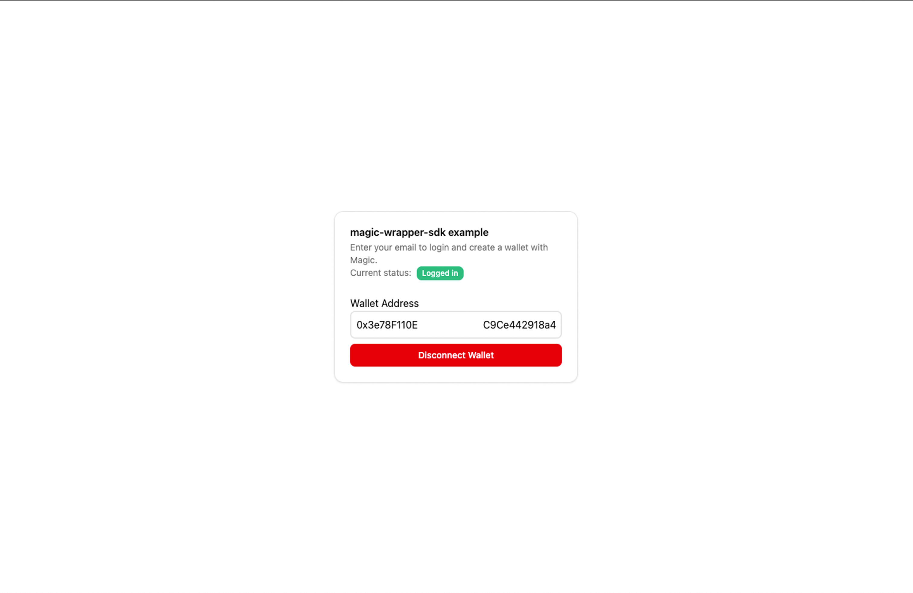

# anomaly-motionbank-nft/Magic Wrapper SDK

Internal wrapper SDK around magic-sdk for React projects. This readme contains a step-by-step example installation instruction using Docker, as well as explanations of Docker-related files.

## Prerequisites

- [Docker](https://docs.docker.com/get-docker/) installed on your machine. Newest version (28.3.2) is preferred.
- (Optional) [Docker Compose](https://docs.docker.com/compose/install/) if not already bundled with Docker

## Dockerfile & docker-compose

- Dockerfile is stored in /example/Dockerfile, used as an instruction for Docker to build a Docker image. This example is using pnpm as its package manager, and its dockerfile content can be explained as below.

```dockerfile
# example/Dockerfile

# ---------- Builder Stage ----------

# use node:20-slim for cross-platform Docker composing.

FROM node:20-slim AS builder

# Create a temporary, clean workdir for a fresh install of node modules
WORKDIR /tmp/build-deps

# Install pnpm globally
RUN npm install -g pnpm

# Copy only pnpm-related files for initial dependency installation
COPY pnpm-lock.yaml ./
COPY package.json ./
COPY example/pnpm-lock.yaml ./example/
COPY example/package.json ./example/

# Force a fresh install of all dependencies
# This step ensures the correct native modules are fetched, preventing issues related to Apple Silicon devices.
RUN pnpm install

# Now, create the final workdir for the build
WORKDIR /app

# Copy the entire project into the app directory
COPY . .

# Copy the node_modules from the temporary directory to the final app directory
RUN cp -a /tmp/build-deps/node_modules /app/node_modules

# Build the SDK/outer module first
RUN pnpm build

# Move into the example app directory
WORKDIR /app/example

# Copy .env and .env.example files if they exist
COPY example/.env* ./
# Create .env
RUN if [ ! -f .env ]; then mv .env.example .env; fi
# Install example dependencies, which will link to the built SDK
RUN pnpm install

# Build the example app
RUN pnpm build

# ---------- Runtime Stage ----------
FROM nginx:alpine

# Copy built example app into nginx html folder
COPY --from=builder /app/example/dist /usr/share/nginx/html

# This container listening on port 80 (of the container). Changing this will not change the port exposed outside.
EXPOSE 80

CMD ["nginx", "-g", "daemon off;"]
```

- docker-compose is stored in the root folder, used to specify how this Docker image should be ran.

```yaml
version: "3.9" # Compose file format version, not the version of Docker itself.

services:
  example-app:
    build:
      context: . # Set the context to the root folder
      dockerfile: example/Dockerfile # specify where the Dockerfile is located
    container_name: magic-wrapper-sdk-example # name of the container
    restart: unless-stopped
    ports:
      - "3000:80" # defines port mapping between your host machine and the container. to change the exposed port, change the "3000" part. "80" is the port of the container which is being listened.

volumes:
  node_modules: {} # use to cache dependencies in a Node.js project
```

## Build & Run

Navigate to **example/.env.example**, then set all values to provided keys.

```env
VITE_MAGIC_API_KEY = xxxxxxxxxx
VITE_ALCHEMY_API_KEY = xxxxxxx
VITE_NETWORK = xxxxxxxx
```

1. Open a terminal, and navigate to the root of this repository:

2. Build the Docker container (without using cache):

```bash
docker compose build --no-cache
```

3. Start the Docker container:

```bash
docker compose up
```

Open your browser and visit **http://localhost:3000** to view the example.

## Result

If the container is built and ran correctly, a screen like this should appear when you navigate to **http://localhost:3000**


## Trying the functions

1. From the starting page, enter your email and click **Login**


2. Check your email, then fill in the OTP sent to you


3. When successfully logged in, a screen like this will appear, with your actual wallet address and a "Disconnect Wallet" button. You can click this to disconnect from current wallet and try the process again.


